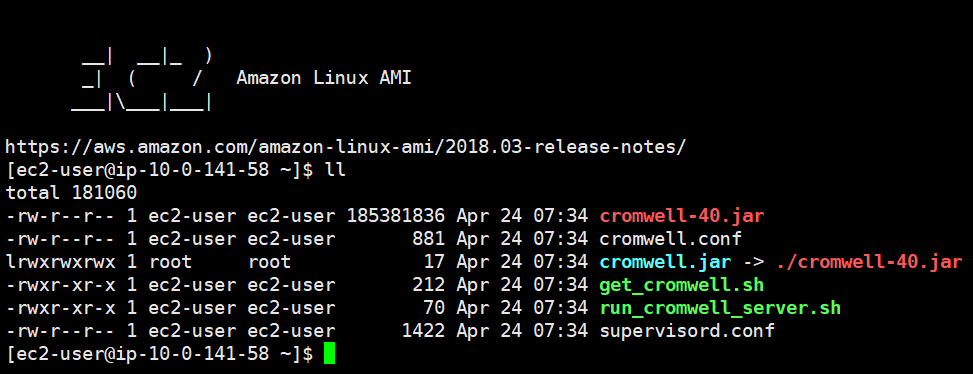
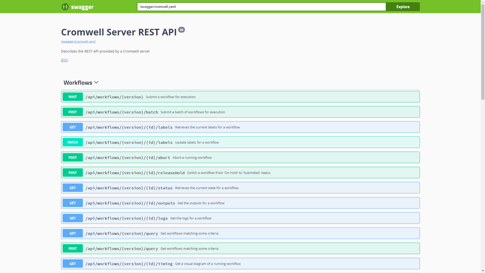

## Cromwell on AWS Batch 懶人包

因有客戶要嘗試做基因體運算，所以就研究了一下 AWS 上的解決方案，在此做一個小的工作紀錄


## 使用到的 AWS 服務

|item | description |
|:---|:---|
|AWS Cloudformation | 建立所有雲端基礎設施資源的模型並進行佈建 |
|AWS Batch | 任何規模的全受管批次處理 |
|AWS ECS | 在生產環境中執行容器化的應用程式 |
|AWS S3 | 專為從任何位置存放和擷取任何數量資料所建立的物件儲存 |
|AWS IAM | 安全地管理對 AWS 服務和資源的存取 |

## 估計費用

主要費用會在 S3 的存放檔案及 EC2 的運算資源上，不過這個部署很有良心都用 Spot Instances 跑運算，所以做一個小測試花不了多少錢

## 動手做1 環境準備

- [x] 不要拿正式環境來玩
- [x] region 選 us-west-2 奧勒岡

1. 登入 AWS 高權限帳號後直接使用 AWS Cloudformation 做整個環境的部署 `https://s3.amazonaws.com/aws-genomics-workflows/templates/cromwell/cromwell-aio.template.yaml`
2. 部署大概要半個小時左右
3. 部署會用到 1 個新建的 VPC，如果原本帳號有多個 VPC 須注意
4. 建立一個合法的 S3 bucket 命名空間，這會放置 cromwell 的運算資料及結果
5. EC2 預先建立 ssh key pair ，使用 cromwell server 的 terminal 會用到

## 動手做2 登入 cromwell server 與 AWS S3 CP 拷貝公開基因資料集



1. ssh 登入透過 AWS Cloudformaion 做出來的主機，可以在 EC2 console 找到機器 IP
2. 複製基因體公開資料到你自己的 s3 bucket (總共 10 GB 左右)
3. 複製的時候等它跑完在跑下一段指令，否則可能會拷貝到不完整的資料
4. 跑完後可以在 S3 console 看到結果

```bash
# your-bucket-name 替換成你自己建立的那個 s3 bucket 名稱
$ aws s3 cp s3://gatk-test-data/wgs_bam/NA12878_24RG_hg38/NA12878_24RG_small.hg38.bam s3://your-bucket-name/
$ aws s3 cp s3://gatk-test-data/wgs_bam/NA12878_24RG_hg38/NA12878_24RG_small.hg38.bai s3://your-bucket-name/
$ aws s3 cp s3://broad-references/hg38/v0/Homo_sapiens_assembly38.dict s3://your-bucket-name/
$ aws s3 cp s3://broad-references/hg38/v0/Homo_sapiens_assembly38.fasta s3://your-bucket-name/
$ aws s3 cp s3://broad-references/hg38/v0/Homo_sapiens_assembly38.fasta.fai s3://your-bucket-name/
$ aws s3 cp s3://gatk-test-data/intervals/hg38_wgs_scattered_calling_intervals.txt s3://your-bucket-name/
```

## 動手做3 hello-world 測試

```bash
# 基本語法
$ java -Dconfig.file=cromwell.conf -jar cromwell-36.1.jar run YOUR.wdl -i YOUR.json
```

- cromwell.conf 產生 Cloudformation 時自動產出，也等同於網路上的部分資料中的 aws.conf 檔，相關的參數都在此設定，一般而言不用改
- cormwell-36.1 產生 Cloudfotmaion 時自動從 cronwell github 下載，如果要用新版的可以用 wget 再去取得新版
- 最後的 wdl , json 可從 hello-world 資料夾取得檔案

實際上輸入的 wdl 後，會由 cromwell server 處理工作流程分配到後端真正運算的叢集，而本例中會透過 AWS EC2 Spot Instances 來處理這類的大規模運算，運算完成後，會直接存到 S3 的 cromwell-execution

## 動手做4 從 AWS S3 讀取 meats.txt 做運算的測試

這邊示範從 AWS S3 讀取一個 txt 檔做運算的方式

1. 先把 meats.txt 放在你建好的 S3 bucket 之中
2. 修改 s3inputs.json 成你自己的 S3 bucket 路徑
3. 用上面 hello-world 的語法跑測試

## 動手做5 Cromwell Swagger API UI

- 透過 SSH Tunnel Forwarding 可以用你桌面電腦的 localhost:8000 直接進 UI 查看圖形介面，也可以從這邊直接選擇檔案部署運算 wdl , json 檔
- 上面那是正規的做法，比較安全，但事實上 AWS Cloudformation 在建立時就問你要不要開 80 port 允許 0.0.0.0/0 的IP了，所以直接用 IP 連線 http://IP:8000 也可以



## 動手做6 real-world case

使用 real-world 案例中的參考，配置 json 跑實際運算後，會根據目前 region 的狀況來呼叫一堆 spot 來做運算，整個過程大概是 1 小時左右   
按照上面的語法將檔案輸入進去，改一下 json 內的 `S3 路徑參數`，如果有興趣的話還可以改一下 `GATK 內的 Docker Image` 看跑出來的結果是什麼   
這邊的運算會真的叫一堆 Spot Instances 來算資料，可用的運算資源可以在 AWS Batch 裡面設定，跑起來會很 High   
最後會在 S3 看到 cromwell-execution 看到資料集，下載回來本機電腦解壓縮後查看 vcf 檔，但那是醫學研究所的範圍了，可以用文字編輯器看一下是啥資料，目前只知道 TGCA 是基因編碼...


## 採坑紀錄

- 使用最新版的 cromwell.jar 跑不一定會成功，因此可能需要用原始教學檔案提供的 cromwell-36.1.jar 這個版本，EC2 沒有就自己去下載吧!
- 如果起 AWS Cloudformation 選的機器規格，使用 t2.mirco 跑 Java 似乎會遇到記憶體不足的問題，還需要調查

## 測試環境的清除

玩完之後記得刪除資源，避免 AWS 費用一直產出

- [ ] Cloudformation
- [ ] AWS Batch 其實只是後端包一層 AWS ECS 的皮，實際都是跑在 ECS 內的 EC2 Container 之中，也可以清除該服務內的資料
- [ ] AWS Cloudwatch 會記錄 LOG
- [ ] AWS S3 放置運算資料用的，用不到就刪掉

## 參考連結

- <https://docs.opendata.aws/genomics-workflows/orchestration/cromwell/cromwell-overview/>
- <https://cromwell.readthedocs.io/en/stable/>
- <http://www.internationalgenome.org/wiki/Analysis/vcf4.0/>
- <https://github.com/broadinstitute/cromwell>
- <https://github.com/aws-samples/aws-genomics-workflows>
- <https://github.com/broadinstitute/cromwell/blob/develop/centaur/src/main/resources/integrationTestCases/germline/haplotype-caller-workflow/HaplotypeCallerWF.aws.inputs.json>
- <https://github.com/broadinstitute/gatk>
- <https://github.com/broadinstitute/cromwell/tree/develop/centaur/src/main/resources/integrationTestCases/germline/haplotype-caller-workflow>
- <https://hub.docker.com/r/broadinstitute/gatk/tags>
- <https://docs.aws.amazon.com/zh_tw/AmazonECS/latest/developerguide/ecs-ami-versions.html>
- <https://github.com/openwdl/wdl>