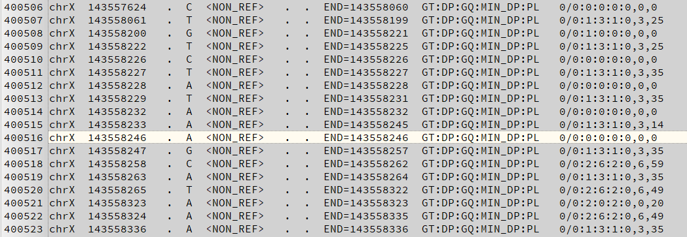

## 懶人包 Cromwell on AWS Batch


https://docs.opendata.aws/genomics-workflows/orchestration/cromwell/cromwell-overview/
https://cromwell.readthedocs.io/en/stable/
http://www.internationalgenome.org/wiki/Analysis/vcf4.0/
https://github.com/broadinstitute/cromwell
https://github.com/aws-samples/aws-genomics-workflows
https://github.com/broadinstitute/cromwell/blob/develop/centaur/src/main/resources/integrationTestCases/germline/haplotype-caller-workflow/HaplotypeCallerWF.aws.inputs.json
https://github.com/broadinstitute/gatk
https://github.com/broadinstitute/cromwell/tree/develop/centaur/src/main/resources/integrationTestCases/germline/haplotype-caller-workflow
https://hub.docker.com/r/broadinstitute/gatk/tags
https://docs.aws.amazon.com/zh_tw/AmazonECS/latest/developerguide/ecs-ami-versions.html
https://github.com/openwdl/wdl

## 使用到的 AWS 服務
|item | description |
|:---|:---|
|AWS Cloudformation | 建立所有雲端基礎設施資源的模型並進行佈建 |
|AWS Batch | 任何規模的全受管批次處理 |
|AWS ECS | 在生產環境中執行容器化的應用程式 |
|AWS S3 | 專為從任何位置存放和擷取任何數量資料所建立的物件儲存 |
|AWS IAM | 安全地管理對 AWS 服務和資源的存取 |

## 動手做1-環境準備

- region 選在 us-west-2
- 不要拿正式環境來玩

1. 登入 AWS 高權限帳號後直接使用 `https://github.com/aws-samples/aws-genomics-workflows/blob/master/src/templates/cromwell/cromwell-aio.template.yaml` 做整個環境的部署
2. 部署大概要半個小時左右
3. 部署會用到 1 個新建的 VPC，如果原本帳號有多個 VPC 須注意
4. 建立一個合法的 S3 bucket 命名空間，這會放置 cromwell 的運算資料及結果
5. EC2 預先建立 key pair , 使用 cromwell terminal 會用到

## 動手做2-登入 cromwell server 拷貝公開基因資料集
1. ssh 登入透過 cloudformaion 做出來的主機，可以在 ec2 console 找到機器 IP
2. 複製基因體公開資料到你自己的 s3 bucket (大概10 GB)

```bash 
$ aws s3 cp s3://gatk-test-data/wgs_bam/NA12878_24RG_hg38/NA12878_24RG_small.hg38.bam s3://your-bucket-name/
$ aws s3 cp s3://gatk-test-data/wgs_bam/NA12878_24RG_hg38/NA12878_24RG_small.hg38.bai s3://your-bucket-name/
$ aws s3 cp s3://broad-references/hg38/v0/Homo_sapiens_assembly38.dict s3://your-bucket-name/
$ aws s3 cp s3://broad-references/hg38/v0/Homo_sapiens_assembly38.fasta s3://your-bucket-name/
$ aws s3 cp s3://broad-references/hg38/v0/Homo_sapiens_assembly38.fasta.fai s3://your-bucket-name/
$ aws s3 cp s3://gatk-test-data/intervals/hg38_wgs_scattered_calling_intervals.txt s3://your-bucket-name/
```

## 動手做3-hello-world 測試

基本語法
```bash
$ java -Dconfig.file=cromwell.conf -jar cromwell-36.1.jar run YOUR.wdl -i YOUR.json
```
- cromwell.conf 產生 cloudformation 時自動產出，也等同於網路上的部分資料中的 aws.conf 檔
- cormwell-36.1 產生 cloudfotmaion 時自動從 cronwell github 下載，如果要用新版的可以用 wget 再去取得新版
- 最後的 wdl , json 可從示範用的資料取得

## 算算看
實際上輸入的 wdl 後，會由 cromwell server 處理工作流程分配到後端真正運算的叢集，而本例中會透過 AWS EC2 Spot instances 來處理這類的大規模運算，運算完成後，會直接存到 S3 的 cromwell-execution

使用 real-world 案例中的參考，配置 json 跑實際運算後，會根據目前 region 的狀況來呼叫一堆 spot 來做運算，整個過程大概是 1 小時左右


## cromwell swagger ui
透過 SSH Tunnel Forwarding 可以用你桌面電腦的 localhost:8000 直接進 UI 查看圖形介面
也可以從這邊直接選擇檔案部署運算 wdl , json 檔

## 算完的結果為 vcf 檔
那是醫學研究所的範圍了，大概可以用文字編輯器看一下是啥資料 TGCA 好像基因編碼


